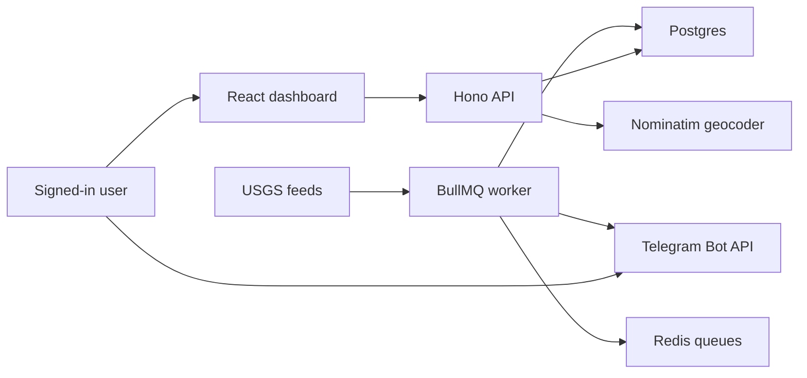

# Architecture

## Overview

Kansha Monitor is a real-time event pipeline around the USGS GeoJSON feeds. The shape mirrors the elder-care system: continuous sensor-like data, occasional critical events, human-facing dashboards, and alert delivery through a verified channel.

## Key Choices

- **Postgres + Drizzle**: structured events, auth, alert history, ingestion logs, and user settings fit relational storage well.
- **JWT auth**: email/password users get a 7-day signed JWT in an HTTP-only cookie. Protected API routes verify the JWT signature without a session-table lookup.
- **No PostGIS for MVP**: 30 days of USGS data is small enough for Haversine filtering in TypeScript. At 30,000 monitored locations, proximity checks should move to PostGIS or spatial indexing.
- **Redis + BullMQ**: separates latency-sensitive web requests from ingestion, alerting, source-silence checks, Telegram bot handling, and daily summaries.
- **Verified Telegram linking**: the bot is public, but chat IDs are only saved when a logged-in user generates and opens a short-lived one-time token.
- **Vite React dashboard**: fast to build and deploy, with Leaflet maps and dense operational views.

## Data Flow

1. Worker starts and ensures global app state exists.
2. If backfill is incomplete, it fetches `all_month.geojson` and upserts events.
3. Every 60 seconds, worker fetches `all_hour.geojson`.
4. Each event is normalized and upserted by USGS event ID.
5. Ingestion health is written to `ingestion_runs` and `app_state`.
6. Successful live polls immediately evaluate global, local, and swarm alert rules.
7. Alerts are stored with deterministic dedupe keys before Telegram delivery.
8. The dashboard reads event, health, alert, location, and Telegram state from the API.

## Telegram Verification

1. User signs in to the web app.
2. User clicks **Connect Telegram**.
3. API creates a 15-minute one-time token and stores only its SHA-256 hash.
4. User opens `https://t.me/<bot>?start=connect_<token>`.
5. Worker verifies token hash, expiry, unused status, and owning user.
6. Worker stores the Telegram chat ID against that user.
7. Unverified Telegram users are told to sign up or connect from the dashboard.

## Alert Rules

- Global high severity: `M >= 5.0`, sent to all linked users.
- Local high severity: `M >= 4.0` within `500 km` of a user location, sent only to that user.
- Swarm: more than 5 earthquakes within 30 minutes inside 200 km.
- Source silence: no successful USGS poll for more than 10 minutes.
- Daily summary: 09:00 IST, one per linked user.

## Scaling View

For 1 user and 3 locations, this system is intentionally simple: Postgres, Redis, one API, one worker. The first likely pressure points at 10,000 users and 30,000 locations are local proximity checks, Telegram delivery volume, and worker scheduling.

Scale path:

- Move location proximity queries to PostGIS.
- Partition or index events by time.
- Split workers by queue: ingestion, alert evaluation, notification delivery, summaries.
- Batch Telegram deliveries and add retry/backoff policies.
- Add queue dashboards and structured log shipping.
- Cache dashboard summaries instead of recomputing per request.

## Failure Modes

- **USGS unreachable or bad data**: record failed ingestion run, keep worker alive, surface degraded health.
- **USGS silent for 10+ minutes**: create source-silence alert once per silence period.
- **Duplicate event in feed**: upsert by USGS event ID.
- **USGS revises an event**: update existing event in place.
- **Duplicate alert risk**: unique alert dedupe keys.
- **Telegram failure**: record failed delivery without losing the alert.
- **Unverified Telegram chat**: do not store chat ID; instruct user to connect from dashboard.
- **Geocoder failure**: return a clear API error and do not create the location.
- **Worker crash**: repeatable BullMQ jobs are restored when worker restarts.

## Deliberate Omissions

- No vector database; the data is structured/time/geospatial, not semantic.
- No PostGIS in MVP; Haversine is enough for assignment scale.
- No live GPS tracking; users monitor chosen places, not current device location.
- No SMS, WhatsApp, voice calls, or operator workflow.
- No complex RBAC beyond admin/user.
- No AI-based alert decisions; safety rules are deterministic and explainable.
- No Prometheus/Grafana stack; ingestion health is stored and visible in the dashboard.
