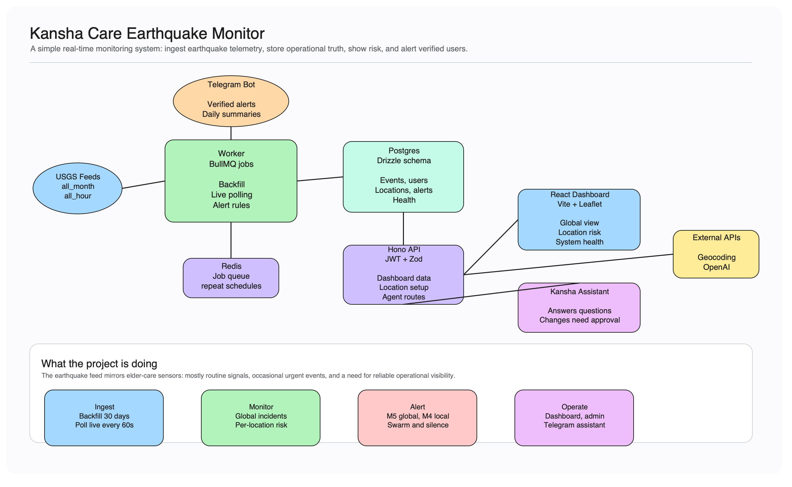
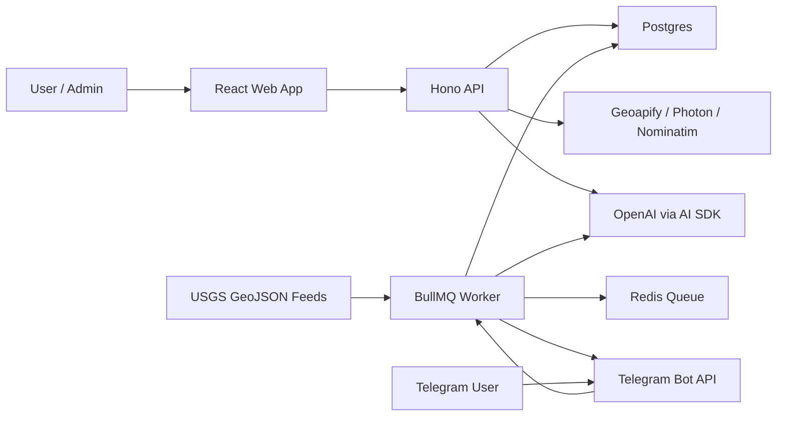

# Architecture

Kansha Monitor treats the USGS earthquake feed like a continuous sensor stream: most events are routine, some need attention, and the source itself must be monitored for silence.

## Main Components

- **Web app (`apps/web`)**: React/Vite dashboard with auth, global map, event search, location risk cards, Telegram connection controls, admin user view, and a floating AI assistant.
- **API (`apps/api`)**: Hono server for auth, dashboard data, locations, Telegram link tokens, admin actions, and streaming assistant chat.
- **Worker (`apps/worker`)**: BullMQ jobs for backfill, startup catch-up, live polling, alert evaluation, source-silence checks, daily summaries, and the Telegram bot.
- **Database (`packages/db`)**: Postgres schema and Drizzle migrations.
- **Shared domain (`packages/types`)**: USGS validation, event normalization, Haversine distance, risk scoring, magnitude bands, alert config, and DTOs.
- **Assistant (`packages/agent`)**: OpenAI/AI SDK tools for summaries, event search, location risk, Telegram status, and user-approved mutations.

## Data Model

- `users`: normal users and admins.
- `earthquake_events`: normalized USGS events plus raw GeoJSON for traceability.
- `ingestion_runs` and `app_state`: poll history, backfill state, source health, insert/update counts.
- `monitored_locations`: up to 3 user locations with radius, magnitude threshold, and enabled state.
- `geocoding_cache`: cached address lookups for API and assistant flows.
- `telegram_link_tokens` and `telegram_chats`: one-time dashboard-to-Telegram linking and active chat records.
- `alerts`, `alert_deliveries`, `daily_summaries`: alert history, per-user delivery status, and daily digest status.
- `agent_conversations`, `agent_messages`, `agent_pending_actions`: web/Telegram assistant state and approval workflow.

## Runtime Flow

1. Worker creates global `app_state` on startup.
2. If needed, it backfills `all_month.geojson`.
3. After backfill, it runs a startup catch-up from `all_day.geojson`.
4. A repeatable BullMQ job polls `all_hour.geojson` every 60 seconds.
5. Events are validated with Zod, normalized, and upserted by USGS event ID.
6. Each ingestion attempt writes an `ingestion_runs` row and updates global health state.
7. New or revised events are evaluated for global, local, and swarm alerts.
8. Alert rows are deduped with deterministic keys before Telegram delivery.
9. The web app reads dashboard, location, Telegram, and admin data through the API.
10. The assistant uses the same database-backed tools from web and Telegram, with approval required for mutations.

## Telegram Flow

1. A signed-in user clicks **Connect Telegram**.
2. API creates a 15-minute token and stores only its SHA-256 hash.
3. The user opens `https://t.me/<bot>?start=connect_<token>`.
4. Worker verifies the token, marks it used, and stores the chat ID.
5. Unlinked Telegram chats are told to connect from the dashboard.
6. Linked users can receive alerts, request status, ask assistant questions, and approve or deny assistant actions.

## Alert Rules

- Global high severity: magnitude `>= 5.0`, sent to all active Telegram chats.
- Local high severity: magnitude `>= user threshold` within the user's configured radius.
- Swarm: more than 5 events in 30 minutes within 200 km.
- Source silence: no successful USGS poll for more than 10 minutes.
- Daily summary: 09:00 IST with event counts, magnitude bands, active regions, alerts, location risks, and health.

## Key Choices

- **Postgres + Drizzle** keeps events, users, health, alerts, assistant state, and audit-like delivery records in one relational model.
- **Redis + BullMQ** separates ingestion and scheduled jobs from web request latency.
- **Hono + Zod** keeps API routes small and validates inputs at the edge.
- **JWT in HTTP-only cookies** gives simple session handling without a session table for the assignment.
- **Leaflet maps** provide a quick, understandable incident view for global and nearby events.
- **Verified Telegram linking** avoids storing random public chat IDs as users.
- **AI assistant with approvals** can explain data freely, but user-impacting actions are explicit and confirmable.
- **No PostGIS for MVP** because the assignment data size is small enough for TypeScript Haversine checks.

## Scaling View

At 1 user and 3 locations, one API, one worker, Postgres, and Redis are enough. At 10,000 users and 30,000 locations, the first pressure points are proximity checks, Telegram delivery volume, and repeated dashboard aggregations.

Scale path:

- Move location proximity queries and swarm detection to PostGIS or a spatial index.
- Split workers by queue: ingestion, alert evaluation, Telegram delivery, summaries, assistant jobs.
- Add delivery batching, rate-limit handling, retries, and dead-letter queues for Telegram.
- Cache dashboard summaries and precompute location risk snapshots.
- Partition or index events by time and magnitude.
- Add structured logs, metrics, queue dashboards, and external uptime checks.
- Store assistant tool results and pending-action expiry cleanup with a scheduled maintenance job.

## Failure Modes

- **USGS unreachable or malformed**: record failed ingestion run, mark health degraded, keep worker alive.
- **USGS silent**: fire a deduped source-silence alert after 10 minutes without success.
- **Duplicate feed events**: upsert by `usgs_id`.
- **Revised USGS events**: update normalized fields and raw payload in place.
- **Duplicate alert risk**: unique `dedupe_key` prevents repeated alert rows.
- **Telegram send failure**: keep alert, mark delivery failed, continue other sends.
- **Expired Telegram link**: reject token and ask user to reconnect from dashboard.
- **Geocoder failure or ambiguity**: return clear API/assistant feedback and avoid creating a bad location.
- **Worker restart**: repeatable BullMQ jobs are recreated on startup, and startup catch-up fills recent gaps.
- **Assistant mutation risk**: web actions require client approval; Telegram actions create pending approvals with inline Approve/Deny buttons.

## Deliberate Omissions

- No PostGIS yet; Haversine is enough for the assignment scale.
- No SMS, WhatsApp, phone-call, or human operator escalation.
- No complex RBAC beyond `admin` and `user`.
- No AI-based safety decisions; alert rules stay deterministic.
- No Prometheus/Grafana stack; health is stored in Postgres and shown in the dashboard.
- No root `.env`; each app owns its own environment file.
- No bundled local Postgres/Redis compose services; deployment expects managed or separately run infrastructure.
